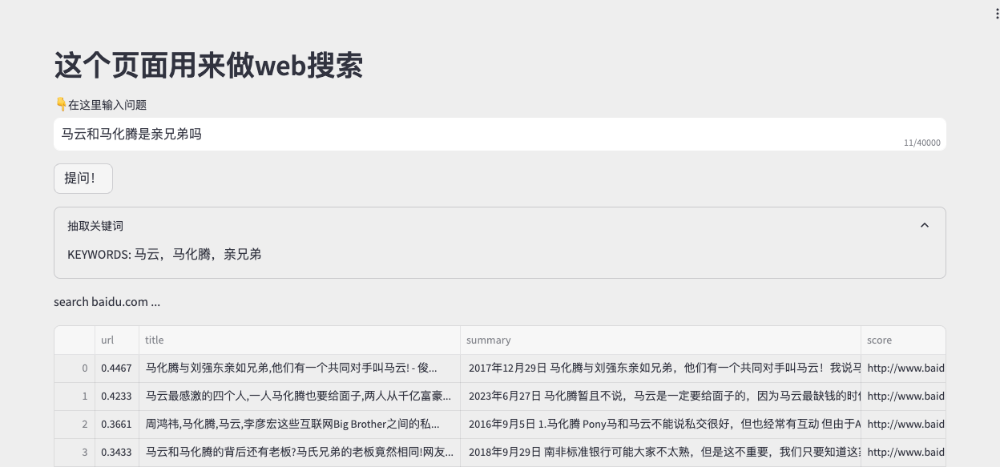
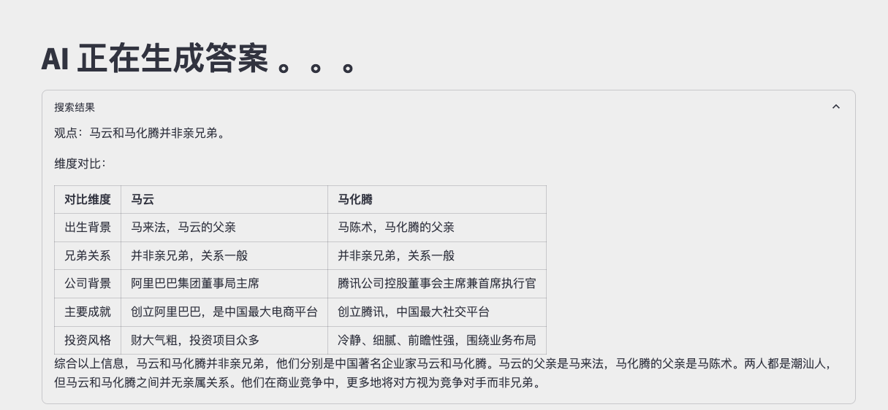

# 可以本地部署的联网助手

项目逻辑流程：
1、根据用户的query，抽取关键词\n
2、搜索百度，并浏览相关的网页、总结相关网页信息\n
3、根据用户query和网页搜索总结的内容，形成结果\n

目前模型使用的是chatglmv3-32k

搜索引擎使用的是百度——基于puppeteer的模拟浏览，使用无头chrome浏览器（也可以自己尝试有头调试）

# 效果




# 下载、准备模型
```
git clone https://github.com/AwsomeName/private_web_gpt.git
cd private_web_gpt
mkdir models
cd models
# 下载chatglm
git clone https://www.modelscope.cn/ZhipuAI/chatglm3-6b-32k.git
cd chatglm3-6b-32k
git lfs fetch
git lfs checkout

# 下载emb model
cd ..
git clone https://www.modelscope.cn/bensonpeng/all-MiniLM-L6-v2.git
cd all-MiniLM-L6-v2
git lfs fetch
git lfs checkout
```

也可以下载量化模型，但是目前不推荐
git clone https://www.modelscope.cn/MaxLeton13/chatglm3-6B-32k-int4.git


# 安装
默认已经拥有conda环境

```
conda create -n web_gpt python=3.10
conda activate web_gpt
pip install -r requirement.txt
```


# 运行
运行前准备！请务必先调试ppeteer，第一次运行的时候，会自动下载chrome无头浏览器
```
python apis/ppeter_search_api.py
```

正式运行

```bash run.sh```


# 后续计划
【】阅读图片
【】多模态问答